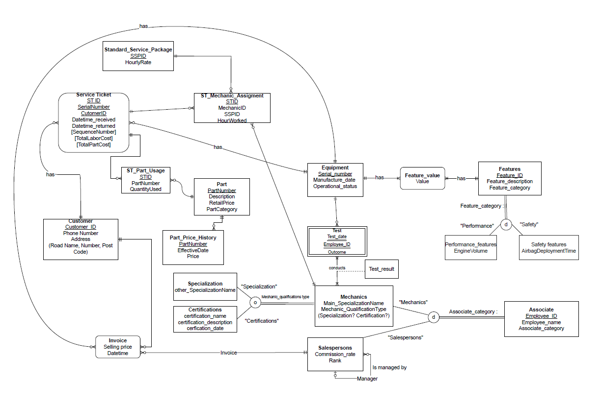

## 1️⃣ SQL Database & Schema Design  
**Manufacturing & Service Workflow System**

Designed and implemented a relational database supporting operational tracking and financial reporting.

### Key Highlights

- End-to-end Entity–Relationship modelling  
- Schema normalisation (3NF)  
- Primary and foreign key architecture  
- Composite keys and referential integrity  
- Stored procedures and triggers  
- Business-driven analytical queries  

### Entity–Relationship Diagram

{width="80%"}

---

## 2️⃣ Investigative Analytics Dashboard  
**R Shiny — VAST Challenge: Covert Reef**

Built an interactive investigative analytics dashboard for anomaly detection, network analysis, and temporal pattern investigation.

🔗 **Live App:**  
[Launch Dashboard](https://dreytwy.shinyapps.io/VastChallengeCovertReef/)

### Key Highlights

- Interactive network visualisation  
- Temporal filtering and dynamic exploration  
- Suspicious behaviour detection  
- Deployable web-based dashboard  

### Embedded Dashboard

<iframe 
  src="https://dreytwy.shinyapps.io/VastChallengeCovertReef/" 
  width="100%" 
  height="650px" 
  style="border:none; border-radius:12px;">
</iframe>
---

## 3️⃣ Pricing & P&L Financial Model  
**Excel + VBA — Retail Strategy & Profit Optimisation**

Developed a dynamic financial decision model integrating pricing strategy, demand forecasting, and profit optimisation.

### Key Highlights

- Price elasticity modelling  
- Monte Carlo simulation (RAND, NORM.INV)  
- Break-even optimisation using Solver  
- VBA automation for scenario analysis  
- Dynamic P&L forecasting dashboard  

---

